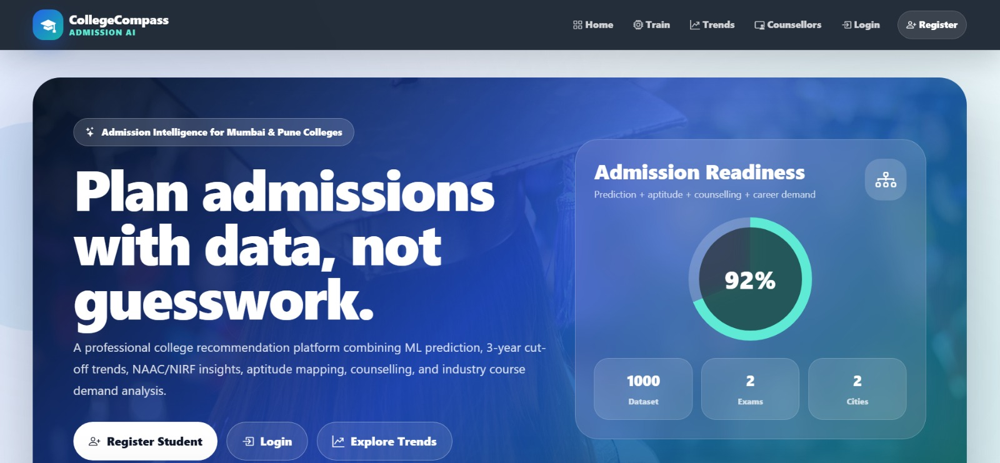
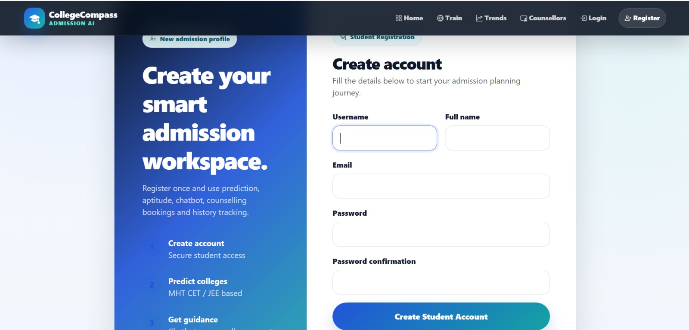
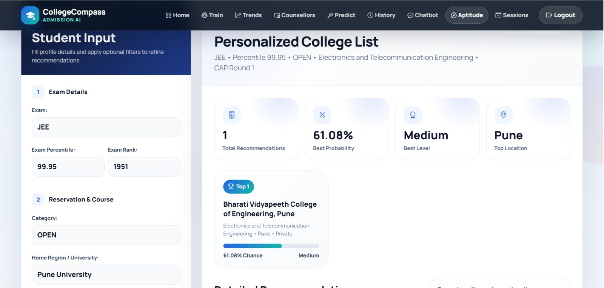
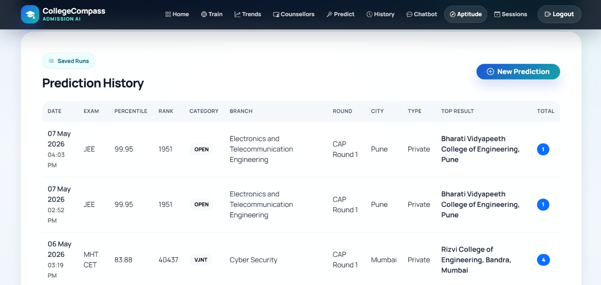

# College Recommendation System - Django + ML + AI Chatbot Counselling

This project implements the requested FR1-FR4 scope using a static Mumbai/Pune college dataset, ML model training, recommendation website, chatbot counselling and human counselling handoff.

## Included FR Coverage

### FR1 Data / Dataset
- 3-year historical cutoff trend: 2022, 2023, 2024
- NAAC grade / NAAC score
- NIRF rank
- Fees per year
- Total seats and category-wise seats
- College type: Govt / Private
- Location: Mumbai / Pune
- Multiple exams: MHT CET and JEE
- Home region / university quota
- Previous year exact closing cutoff display

### FR2 Student Input and Profiling
- Student registration and secure login
- Captures exam, percentile, rank, category, quota, branch, location, fees and aptitude score
- Stores latest student profile for prediction and chatbot counselling

### FR3 College Prediction Engine
- RandomForestRegressor predicts closing percentile
- RandomForestClassifier predicts admission probability class
- Weighted probability logic uses current predicted cutoff, previous year cutoff and aptitude score
- Output table shows college details, cutoff, trend, NAAC/NIRF, fees, seats and chance level

### FR4 AI / Chatbot Counselling
- Chatbot page: `/chatbot/`
- Answers student queries instantly using platform college prediction data, historical cutoffs and FAQ logic
- Gives context-aware suggestions from logged-in student profile
- Example: “Given my JEE percentile, which Pune colleges are safe?”
- Human counselling booking handoff page: `/book-counselling/`
- Admin can view chatbot messages and counselling bookings in Django admin

## Technology

- Frontend: HTML, CSS, JavaScript, Bootstrap 5
- Backend: Python Django
- Database: SQLite
- ML Algorithms: RandomForestRegressor + RandomForestClassifier
- Dataset: `data/dataset.csv` with 1000 records
- Chatbot: Rule-based AI counselling engine using dataset + student profile + FAQs, no external API key required

## Project Setup

```bash
cd college_recommendation_mumbai_pune_ml_django

python -m venv venv
venv\Scripts\activate

pip install -r requirements.txt

python manage.py makemigrations
python manage.py migrate

python manage.py load_dataset --clear
python manage.py train_model

python manage.py createsuperuser
python manage.py runserver
```

Open:

```bash
http://127.0.0.1:8000/
```

## Important Pages

```bash
/                    Home
/register/            Student registration
/accounts/login/      Login
/train/               Load dataset + train ML model
/predict/             College recommendation page
/history/             Previous prediction history
/chatbot/             AI chatbot counselling
/book-counselling/    Human counselling booking handoff
/admin/               Admin panel
```

## Training Outputs

After running:

```bash
python manage.py train_model
```

the system creates:

```bash
ml_models/college_cutoff_model.joblib
ml_models/college_probability_classifier.joblib
ml_models/model_metadata.json

training_reports/classification_report.txt
training_reports/classification_report.csv
training_reports/confusion_matrix.png
training_reports/confusion_matrix.csv
training_reports/training_metrics.json
```

## Chatbot Questions You Can Try

```text
Given my JEE percentile, which colleges are safer for me?
Show previous year cutoff trend for my branch and category.
Top Pune colleges by NIRF and NAAC rating.
Which colleges have lower fees in Mumbai?
I want to book human counselling session.
What documents are required for CAP counselling?
```

## Dataset Columns

```text
record_id, year, exam, round, category, home_region, university_quota,
stream, branch, college_code, college_name, college_type, city, district,
state, naac_grade, naac_score, nirf_rank, fees_per_year, total_seats,
category_seats, student_percentile, student_rank, aptitude_score,
aptitude_stream_suitability, closing_percentile, closing_rank,
previous_year_closing_percentile, previous_year_closing_rank,
cutoff_trend_3yr, admission_probability
```


## Screenshots

### Home Page


### Login / Registration


### Student Profile Input


### College Recommendation Results



## Note

The dataset is synthetic/sample data for project demonstration. For final submission, replace `data/dataset.csv` with official CAP/JEE/MHT-CET data.

## Added FR5, FR6, FR7 Modules

### FR5 Counselling Services
- `/counsellors/` shows certified human counsellor profiles, availability, mode and fees.
- `/book-counselling/` creates one-to-one counselling booking using latest student profile, prediction history and aptitude result.
- `/payment/<session_id>/` provides demo payment confirmation. Replace this demo flow with Razorpay/Stripe for production.
- `/my-counselling-sessions/` shows student bookings and meeting links.
- `/counsellor-dashboard/` lets staff/counsellor view student profile, predicted college list and aptitude summary before session.

### FR6 Aptitude and Career Assessment
- `/aptitude-test/` RIASEC-based psychometric test.
- `/aptitude-result/` shows career suitability report and cross-references recommended streams with college dataset.

### FR7 Trending Industry Course Analysis
- `/trending-courses/` calculates and displays Demand Index.
- Formula: Demand Index = 0.4 × Job Market Growth + 0.3 × Search Interest Growth + 0.2 × Course Enrollment Growth + 0.1 × Salary Growth.

### Additional setup command

```bash
python manage.py seed_career_services
```

Recommended fresh run:

```bash
python manage.py makemigrations
python manage.py migrate
python manage.py load_dataset --clear
python manage.py seed_career_services
python manage.py train_model
python manage.py runserver
```


